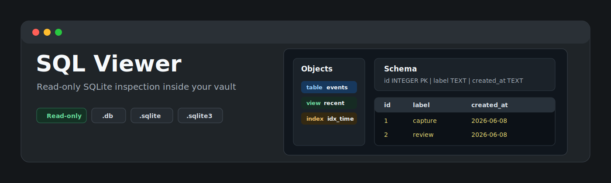
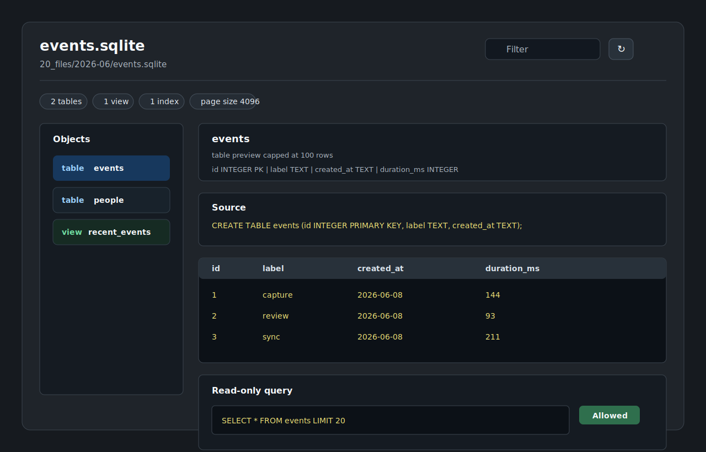

<p align="center">
  
</p>

<p align="center">
  <a href="https://github.com/viggomeesters/obsidian-sql-viewer/releases/latest"></a>
  <a href="LICENSE"></a>
  
  
</p>

# SQL Viewer

SQL Viewer is a read-only Obsidian plugin for inspecting local SQLite database files with `.sqlite`, `.sqlite3`, and `.db` extensions. It also catches SQLite sidecar files such as `.sqlite-wal`, `.sqlite-shm`, `.db-wal`, and `.db-shm` so they do not fail silently when shown by hidden-file plugins.

It is intentionally narrow: table and view browsing, schema/source inspection, capped row previews, metadata, refresh, filtering, and a constrained read-only query runner. It is not a database editor, migration tool, export tool, charting app, or general SQL IDE.



## Features

- Opens `.sqlite`, `.sqlite3`, and `.db` files in a dedicated view.
- Shows a read-only sidecar explanation for `.sqlite-wal`, `.sqlite-shm`, `.db-wal`, and `.db-shm` files, with an **Open base database** action when the matching database exists.
- Shows database metadata: page count, page size, encoding, schema version, user version, and application id.
- Lists tables, views, and indexes from `sqlite_master`.
- Shows table/view schema through safe SQLite metadata calls.
- Shows source SQL for tables, views, and indexes when SQLite stores it.
- Renders a capped row preview with lazy per-object loading.
- Filters objects and preview rows.
- Runs single-statement read-only `SELECT` or `WITH` queries with a row cap and elapsed-time guard.
- Blocks mutating SQL keywords including `INSERT`, `UPDATE`, `DELETE`, `DROP`, `ALTER`, `CREATE`, `VACUUM`, `ATTACH`, and `PRAGMA`.
- Stays local-only: no network APIs, no clipboard APIs, and no database write-back.

## SQLite sidecar files

SQLite can create runtime sidecars next to the main database:

- `x.sqlite-wal` and `x.db-wal` are write-ahead log files.
- `x.sqlite-shm` and `x.db-shm` are shared-memory index files.

These files are not standalone databases. SQL Viewer registers those extensions only to avoid dead clicks or parse errors in vaults where hidden/runtime files are visible. It does not replay WAL data, checkpoint, repair, vacuum, or write to the database. When the matching base database is present, the sidecar view offers an **Open base database** action:

- `x.sqlite-wal` -> `x.sqlite`
- `x.sqlite-shm` -> `x.sqlite`
- `x.db-wal` -> `x.db`
- `x.db-shm` -> `x.db`

## Read-only query behavior

The query runner accepts only one statement that starts with `SELECT` or `WITH`. It rejects multi-statement SQL and blocks keywords associated with mutation, attachment, transactions, maintenance, and pragmas.

Every opened in-memory database receives `PRAGMA query_only = ON`, and rendered results are wrapped with an outer `LIMIT`. The default query cap is 200 rendered rows. Table previews are capped at 100 rendered rows.

The elapsed-time guard is a UI responsiveness guard around statement iteration. Because sql.js executes synchronously in WebAssembly, a single expensive SQLite step cannot be interrupted mid-step. For that reason, SQL Viewer keeps the runner deliberately small and documents it as an inspection aid, not as an analytical query engine.

## Dependency and bundle tradeoff

SQL Viewer uses [`sql.js`](https://github.com/sql-js/sql.js), SQLite compiled to WebAssembly. The WASM bytes are bundled into `main.js` via esbuild instead of being fetched as a sidecar file at runtime. This keeps the plugin self-contained and local-only, with the tradeoff that `main.js` is much larger than a plain text viewer plugin.

## Existing plugin overlap

This plugin exists only as a minimal, stricter read-only variant. Current community options already cover broader SQLite workflows:

- [SQLite Explorer](https://community.obsidian.md/plugins/sqlite-explorer) is close to this scope and offers table selection, schema inspection, and a read-only SQL runner.
- [SQLite DB Viewer](https://community.obsidian.md/plugins/sqlite-db-viewer) uses `sql.js` and describes broader query/edit/visualization behavior.
- [SQLite DB](https://community.obsidian.md/plugins/sqlite-db) focuses on queries, charts, and exports from notes.

SQL Viewer does not try to replace those broader tools. It deliberately omits editing, exports, charting, note generation, server databases, and general `.sql` script viewing.

## Installation

### Manual installation

1. Download `main.js`, `manifest.json`, and `styles.css` from the latest release.
2. Create this folder in your vault: `.obsidian/plugins/sql-viewer/`.
3. Put the downloaded files in that folder.
4. Reload Obsidian.
5. Enable **SQL Viewer** in **Settings -> Community plugins**.

### BRAT installation

For beta testing, install the plugin with [BRAT](https://github.com/TfTHacker/obsidian42-brat) using this repository URL:

```text
https://github.com/viggomeesters/obsidian-sql-viewer
```

## Usage

Open any `.sqlite`, `.sqlite3`, or `.db` file in your vault. Obsidian will open it with SQL Viewer.

If hidden-file tooling exposes `.sqlite-wal`, `.sqlite-shm`, `.db-wal`, or `.db-shm` files, opening them shows a sidecar explanation instead of trying to parse them as databases.

Use the object list to choose a table or view. The main panel shows schema, source SQL, and a capped preview. Use the filter field to narrow object names and rendered preview rows. Use **Refresh database** after replacing a database file on disk.

The query runner is for small read-only inspection queries:

```sql
SELECT * FROM my_table LIMIT 20
```

```sql
WITH recent AS (
  SELECT *
  FROM my_table
  ORDER BY id DESC
  LIMIT 20
)
SELECT * FROM recent
```

## Development

```bash
npm install
npm run build
npx tsc --noEmit
npm test
npm run community:check
```

For local development, copy or symlink this repository into `.obsidian/plugins/sql-viewer/` inside an Obsidian vault.

## Security checks

The test suite covers:

- valid `.sqlite`, `.sqlite3`, and `.db` fixtures
- `.sqlite-wal`, `.sqlite-shm`, `.db-wal`, and `.db-shm` sidecar mapping fixtures
- multiple tables
- view and index discovery
- large table row caps
- malformed database rejection
- allowed `SELECT` and `WITH` queries
- blocked write and maintenance statements
- source-level checks for network, clipboard, process, dynamic execution, and vault mutation APIs

## Release process

Obsidian installs community plugin files from GitHub releases. For each release:

1. Update `manifest.json`, `package.json`, and `versions.json`.
2. Run `npm install`, `npm run build`, `npx tsc --noEmit`, and `npm test`.
3. Create a GitHub release whose tag exactly matches `manifest.json.version`.
4. Attach `main.js`, `manifest.json`, and `styles.css` as release assets.

## Community directory submission

This repository is prepared for Obsidian Community plugin submission.

Submit this repository URL:

```text
https://github.com/viggomeesters/obsidian-sql-viewer
```

Before submitting:

- Make sure the latest GitHub release tag exactly matches `manifest.json.version`.
- Make sure release assets include `main.js`, `manifest.json`, and `styles.css`.
- Run `npm run community:check`.
- Sign in to [community.obsidian.md](https://community.obsidian.md), link GitHub, open **Plugins -> New plugin**, enter the repository URL, and submit.

## License

[MIT](LICENSE)
